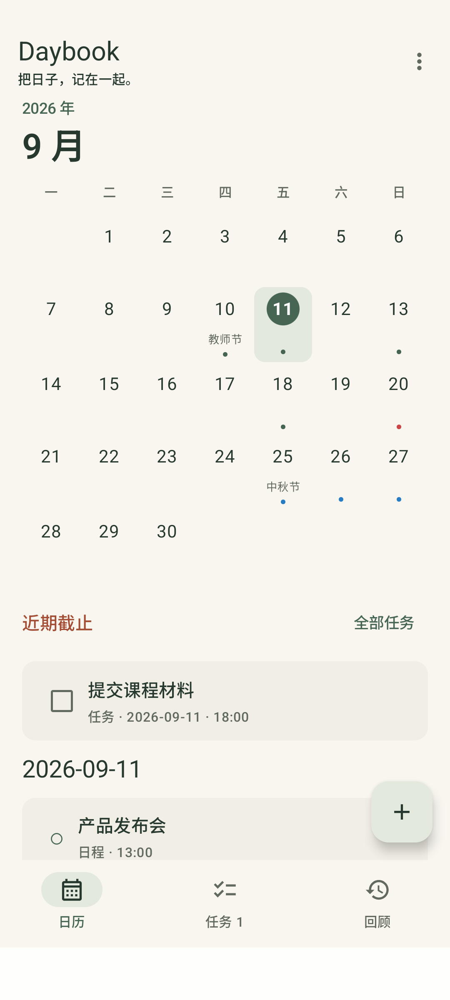
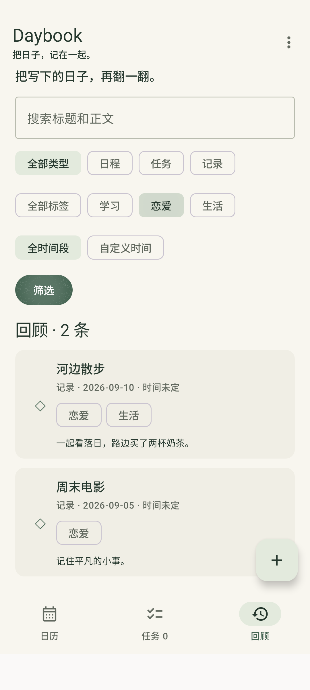
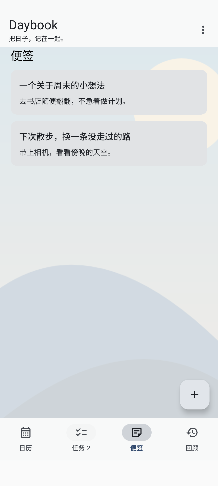
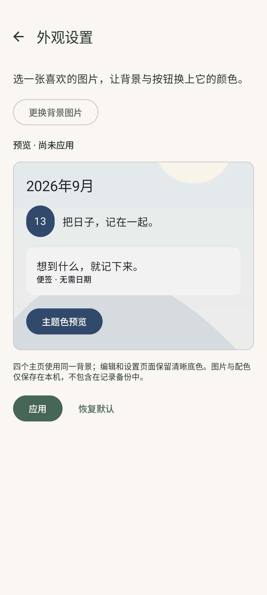
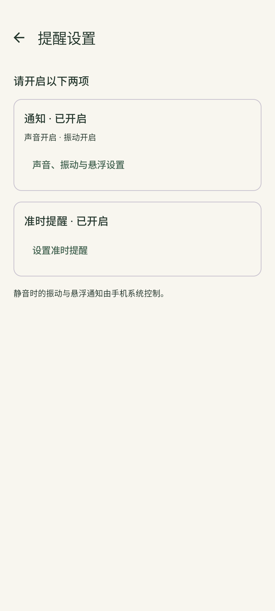

# Daybook

一款离线安卓个人日历。像纸质日历一样，统一记录日程、截止任务和生活片段，也能用独立便签随手记下所想。

## v0.7 AI辅助版

当前版本为0.7.1/code9。普通记录功能继续离线使用；可选AI功能在你配置DeepSeek API Key并发送消息时联网。

- 普通连续聊天、模型/深度思考选择；聊天只在应用进程内保留，API Key在本机加密保存。
- 单条/多条录入、便签整理、任务拆解及草稿多轮调整，预览确认后事务保存。
- 个人事项按需只读查询、来源跳转和阶段回顾；可以切换为仅聊天，不自动修改原数据。
- 通知先打开只读详情，点击右上角「编辑」后修改；日历页的任务仅出现在「近期截止」。
- 任务完成反馈只作用于被操作的任务。Room6/ZIP JSON6保持不变，电脑端和同步暂缓。

已验证范围与限制见[验收记录](docs/TESTING.md)，操作见[使用说明](docs/USAGE.md)，方案见[V0.7-AI.md](docs/V0.7-AI.md)。真实DeepSeek效果与真机验收需单独验证，假服务测试不代表线上模型效果。

## 已发布 v0.6.0 功能

- Kotlin / Jetpack Compose / Room，Android 8.0 及以上。
- 单行年月、跟手滑动换月、三类记录、任务分区与数量、近期与逾期截止提示。
- 独立便签：无需标题和日期，正文自动保存、完成退出，可选日期与提醒。
- 已完成任务折叠分区、勾选划线动画；任务、便签及日历当天事项左滑确认删除。
- 相册分组选图、完整调色盘与独立主题色，四主页统一背景，可预览和恢复默认。
- 首次通知授权与一次可跳过提醒设置引导，多品牌后台与悬浮通知建议。
- 不联网，不要求账号；通过系统文件选择器导出完整 ZIP 图文备份，也可恢复旧 JSON 备份。
- 日程/任务可设置独立通知提醒；标签、类型、时间段与标题/正文组合筛选。
- 内置 2025/2026 放假调休及常用节日，蓝点放假、红点补班、绿点个人事项。
- 手机竖屏界面；支持事项及便签正文内插图，暂不包含自动同步、AI 录入和重复日程。

## v0.6 更新

- 独立单次及重复提醒、统一提醒列表、可选日历显示和后台运行引导。
- 日程、任务、记录和便签正文内插图，支持大图查看、移除及含图片的完整备份恢复。
- 新任务默认「不设截止日期」，可自行设置；已有任务截止日期保留。

0.6.0 / code 7，Room6 / ZIP中的JSON6清单，兼容旧数据和JSON1–5备份；无网络或新依赖。隐私便签与拖动排序需求已取消。详见[发布说明](docs/releases/v0.6.0.md)、[图片实施记录](docs/V0.6-IMAGES.md)和[提醒第一批记录](docs/V0.6-M1.md)。

## 安装与上手

[下载 v0.7.0](https://github.com/lukino0737/daybook/releases/tag/v0.7.0) · [使用说明](docs/USAGE.md) · [构建方法](docs/BUILD.md)

将 APK 下载到 Android 8.0+ 手机安装。旧版用户先导出备份，再直接覆盖安装，勿先卸载。首次打开没有预填数据。点日期再点右下角「+」；右上角菜单可以导出或恢复备份。

截图中的个人事项是虚构测试样例，不随安装包提供。节假日数据随安装包内置。

## 验证与维护

各版本的自动测试、模拟器检查和升级验证分别记录在 [验收报告](docs/TESTING.md)。提醒需要通知和准时提醒权限；各品牌手机的后台表现仍需真机试用。

每个里程碑都有独立提交。开发进度见 [开发日志](docs/DEVELOPMENT.md)，详细证据与限制见 [验收报告](docs/TESTING.md)，范围见 [第一阶段计划](docs/PLAN.md) 、[第二阶段计划](docs/PHASE2.md) 、[v0.3 改进方案](docs/V0.3-PLAN.md) 、[v0.4 已批准方案](docs/V0.4-PLAN.md) 和 [v0.5 操作体验](docs/V0.5-M2.md)。

这是一个持续维护的 AI 辅助开发项目，可以从 [代码阅读与练习路线](docs/LEARNING.md) 开始。

## 数据

日程和生活记录不会逾期。任务的日期表示截止日期；没有具体时间时，截止日结束之后才算逾期。无日期任务位于任务列表下方。

个人数据、备份和签名密钥不进入仓库。卸载应用会清除本地数据，请先导出备份。ZIP备份包含记录、便签、独立提醒和正文图片，兼容旧JSON1–5；整体恢复旧备份会移除其中不包含的新类型数据，确认页明确提示并先保存完整快照。背景和配色是本机偏好，不包含在记录备份中。
